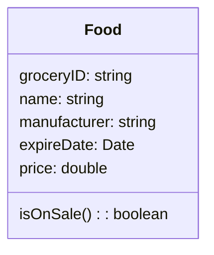

# Abstraction

Abstraction is one of the main ways that humans deal with complexity. It's the idea of simplifying a concept in the problem domain to its essentials within some context. 

Abstraction allows you to better understand a concept by breaking it down into a simplified description that ignores unimportant details.

When designing an object-oriented program, abstraction is essential. You create models of how objects are represented in your system, but these models cannot be created without forethought.

In object-oriented modeling, abstraction pertains most directly to the notion of a **class**. When you use abstraction to decide the essential characteristics for some concept, it makes the most sense to define all of those details in a class named after the concept. 

## Choosing Relevant Attributes and Behaviors

*Let's take the concept of a person. What are the essential characteristics of a person that we care about? This question is hard to answer because person is so vague and we haven't said what the purpose of our person is.*

The abstractions you create are relative to some context, and there can be different abstractions for one concept.

When considering abstraction, we must identify relevant attributes and behaviors for a concept.

*For example, in an academic setting, relevant attributes for a student would include the courses they're currently taking, their grades in each course, and their student ID number. Relevant behaviors would include studying, doing assignments, and attending lectures.*

Within the context of an abstraction, anything other than a concept's essential attributes and behaviors is irrelevant.

*When considering our student in the context of an academic setting, we don't care whether the student has a pet or how they clean their kitchen or what their favorite video game is. Those are all irrelevant details to the abstraction in this context.*

## Updating Abstraction

Abstractions are formed within a specific context for perspective, and you have to carefully decide what is relevant. 

If the purpose of your system or the problem changes, don't be afraid to update your abstractions accordingly.

Abstractions are not a fixed creation but are a direct result of the problem for which you created them.

## Abstraction in UML class diagram

Each class in the Class Diagram is represented by a box. Each box has three sections. 

The top part is the **Class Name**. This would be the same as the class name in your Java class. 

The middle part is the **Property** section. This would be equivalent to the member variables in your Java class and defines the attributes of the abstraction. 

The bottom part is the **operations** section which is equivalent to the methods in your Java class and defines the behaviors of the abstraction.

