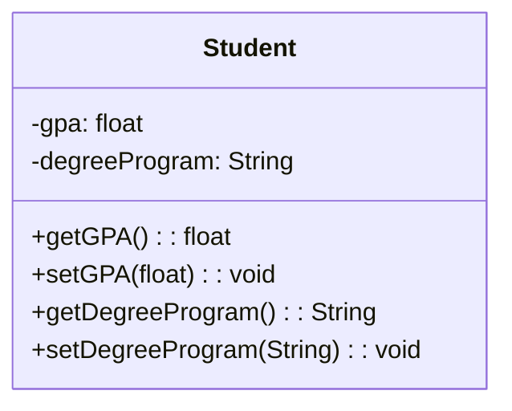

# Encapsulation

## What is Encapsulation?

Encapsulation involves bundling attribute values or data and behaviors or functions that manipulate those values together into a self-contained object. It involves three key ideas as follows:
- Bundling of attribute values or data and behaviors or functions that manipulate those values together into a self-contained object. 
- Exposing certain data and functions of the object, which can be accessed from other objects.
- Restricting access to certain data and functions to only within that object.

## Why is Encapsulation Important?

Encapsulation forms a self-contained object by bundling the data and functions it requires to work, exposes an interface whereby other objects can access and use it, and restricts access to certain inside details. This makes programming easier when data, and the code that manipulates that data, are located in the same place. 

## Encapsulation and Classes

Encapsulation naturally occurs when you define a class for a type of object. Abstraction helps determine what attributes and behaviors are relevant about a concept in some context. Encapsulation ensures that these characteristics are bundled together in the same class.

## Methods and Behaviors

Besides attributes, a class also defines behaviors through methods. For an object of the class, the methods manipulate the attribute values or data in the object to achieve the actual behaviors. You can expose certain methods to be accessible to objects of other classes, thus, providing an interface to use the class.

## Data Integrity and Security

Encapsulation helps with data integrity by defining certain attributes and methods of a class to be restricted from outside access. In practice, you often present outside access to all the attributes except through specific methods. This way, the attribute values of an object cannot be changed directly through variable assignments.

## Achieving Abstraction Barrier

Encapsulation achieves what is called the Abstraction Barrier. Since the internal workings are not relevant to the outside world, this achieves an abstraction that effectively reduces complexity for the users of a class. This increases reusability because another class only needs to know the right method to call to get the desired behavior, what arguments to supply as inputs, and what appear as outputs or effects.


## Encapsulation in UML class diagram

If you are creating a system that models a university student using encapsulation, you would have all of the student's relevant data defined in attributes of a student class. You would also need specific public methods that access the attributes.

In this example, our student's relevant data could be their degree program and GPA. This would be the UML class diagram for the student class.

The student class has its attributes hidden from public accessibility. This is denoted by the minus signs before GPA and degree program. These minus signs indicate that a method or attribute is private. 

Private attributes can only be accessed from within the class. 

Outside this class, instead of being able to directly manipulate the student's GPA attribute, you must set the GPA through a public method `setGPA`. By only allowing an object's data to be manipulated via a public method, you can control how and when that data is accessed.



```java
public class Student {
  private float gpa;

  public float getGPA() {
    return gpa;
  }

  public void setGPA(float newGPA) {
    gpa = newGPA;
  }
}
```
