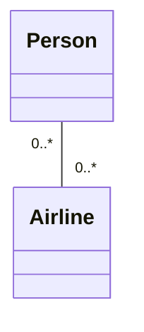
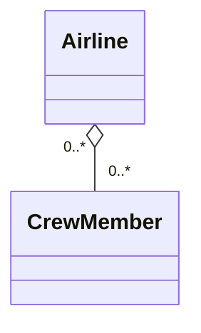
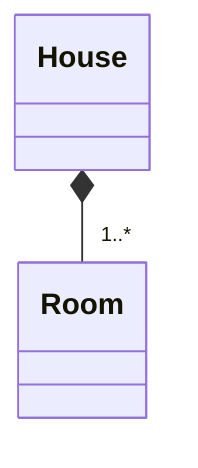

# Decomposition

## Understanding Decomposition

Decomposition involves breaking down a whole thing into different parts or combining separate parts with different functionalities to form a complete object. This helps in solving complex problems by making them easier to understand.

*For instance, considering an object like a car or refrigerator, using decomposition, we can break it down into different parts that have specific responsibilities. A transmission, motor, wheels, tires, doors, windows, seats, and fuel are some of the constituent parts of a car, whereas a refrigerator may have parts like compressor and coils, freezer, ice-maker, shelves, drawers, and food items. Each of these parts has a specific purpose towards achieving the overall objective of the whole.*


## Fixed vs Dynamic Number of Parts

The lifetime of a whole object and its parts determines if the number of parts is fixed or dynamic.

*A fridge has a fixed number of freezers, but the number of shelves and food items can vary over time. In contrast, some parts like steering wheels, tires, and engines in cars have a fixed number, whereas the number of passengers is dynamic.*


## Parts within Parts

A part of an object can act as a whole and contain further constituent parts.

*For example, an instrument panel in a car contains speedometers, odometers, and fuel gauges, among other parts.*

## Related Lifetimes

Sometimes, the lifetimes of the whole and its parts are closely related.

*The refrigerator and the freezer have the same lifetime, and one cannot exist without the other. However, this is not true for all parts, as some parts like food items in a fridge can exist independently.*

## Parts Sharing

Objects may contain parts that are shared among them at the same time.

*For instance, multiple families can share a person as their common family member. However, sometimes sharing is not possible or intended, and each object has its unique parts.*

Overall, decomposition enables breaking down a complicated object into separate, simpler parts with specific roles. It's important to evaluate how different responsibilities of some whole object can be separated into different parts, each with its own specific responsibility, based on fixed or dynamic numbers, lifetimes, and sharing, where applicable.


## Decomposition in UML class diagram

There are three types of relationships found in decomposition - association, aggregation, and composition, which define the interaction between the whole and the parts.

### Association Relationship

Association is a loose relationship between two objects where they can interact with each other but do not belong to each other.

An example of this relationship is between a person and an airline.

The UML diagram notation for an association is a straight line between two objects denoting that the relationship between them is an association.

The number found on both sides of the relationship indicates how many objects are associated with each other.



```java
public class Student {
  // Sport is not a member of Student
  // Sport is created independently and interact with Student at runtime
  public void play(Sport sport) { ... }
}
```

### Aggregation Relationship

Aggregation is a has-a relationship where a whole has multiple parts that belong to it, but both can exist independently.

For example, an airliner and its crew have an aggregation relationship.

The UML notation for aggregation is an empty diamond symbol next to the whole object.



```java
public class Airliner {
  // CrewMember belong to Airliner as a member variable
  private ArrayList<CrewMember> crew;

  public Airliner() {
    // CrewMember can be created outside of Airliner
    crew = new ArrayList<CrewMember>()
  }

  public void add(CrewMember crewMember) { ... }
}
```


### Composition Relationship

Composition is an exclusive containment of parts, otherwise known as a strong has-a relationship. A whole cannot exist without its parts, and if one part is destroyed, the whole ceases to exist.

An example of this relationship is between a house and its rooms.

The UML notation for composition is a filled diamond symbol next to the whole object.

All three relationships have their uses and benefits and can be applied in software designs as required.



```java
public class Human {
  private Brain brain;

  public Human() {
    // Brain object can not be created outside Human class
    // Brain object will be destroyed when Human is destroyed
    brain = new Brain();
  }
}
```
