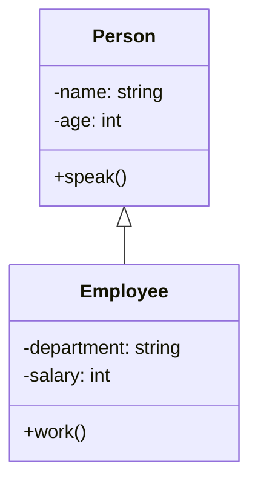
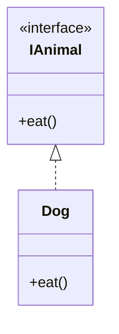
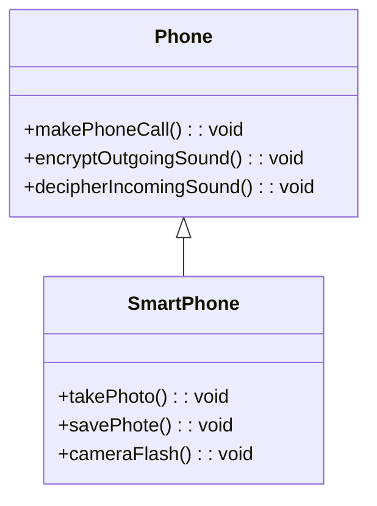
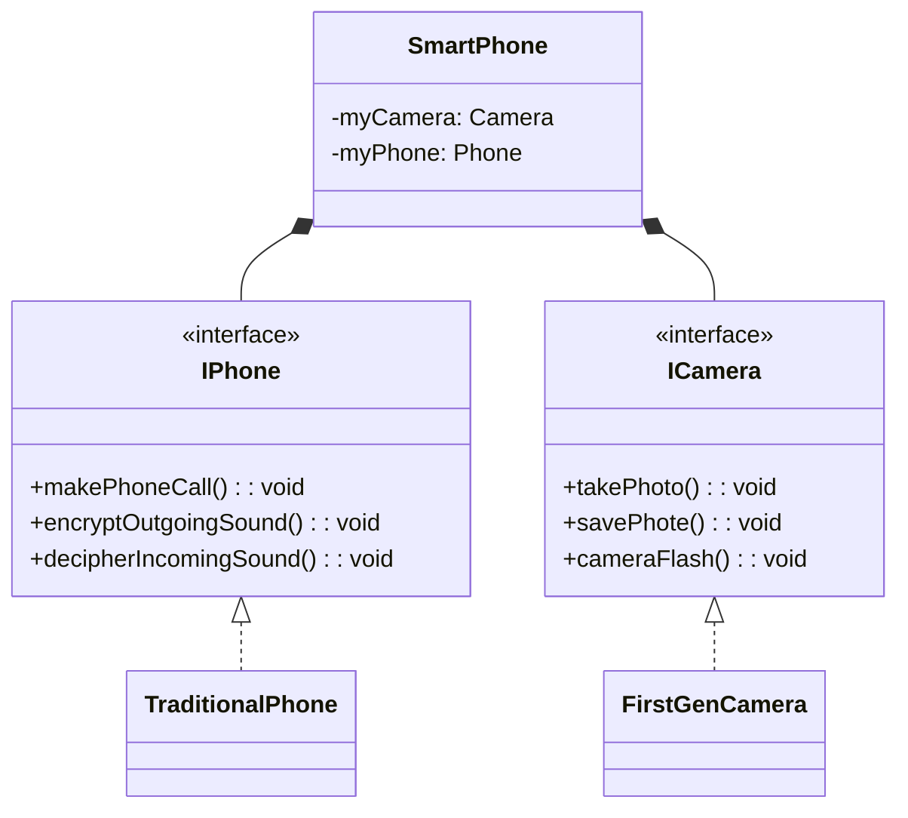

# Generalization

Generalization is a design principle that helps to reduce redundancy when solving problems.

It allows us to model behaviors using methods and eliminates the need to have identical code written throughout a program.


## Applying Generalization through Inheritance

Generalization can be applied to classes through **inheritance**.

In this process, we take repeated or shared characteristics between two or more classes and factor them out into another class.

Specifically, we create a parent class and a child class. When a child class inherits from a parent class, it receives the attributes and behaviors of the parent class.

The parent class is known as a superclass, and the child class is called a subclass.


## Example: Generalizing Animal Characteristics

For example, if we want to model the characteristics and behaviors of a cat and a dog, we can create a superclass called "animal" that contains the common attributes and behaviors between them.

Both cat and dog subclasses inherit these attributes and behaviors from the animal superclass. This makes our code more flexible, maintainable, and reusable since any changes made to the superclass will apply to all its subclasses.


## Benefits of Generalization

Generalization can make code more reusable by allowing different classes or methods to share the same blocks of code. Systems become easier to maintain because there is no repetitious code. 

By learning how to identify commonalities between classes and their behaviors, you can design highly robust software solutions that are easier to expand, apply changes to, and maintain.


## Generalization in UML class diagram

### Using Inheritance

To show inheritance in a UML class diagram, simply connect two classes with a solid lined arrow. The superclass is at the head of the arrow, and the subclass is at the tail. Inheritance means that the subclass will have all attributes and methods from the superclass, making the superclass the generalized class and the subclass the specialized class.



```java
public abstract class Animal {
  protected int numberOfLegs;
  protected int numberOfTails;
  protected String name;

  public Animal(String petName, int legs, int tails) {
    this.name = petName;
    this.numberOfLegs = legs;
    this.numberOfTails = tails;
  }

  public void walk() {}
  
  public void run() {}
  
  public void eat() {}
}

public class Dog extends Animal {
  public Dog(String name, int legs, int tails) {
    super(name, legs, tails);
  }
  
  public void playFetch() {}
}
```


### Using Interfaces

Interfaces are drawn in UML class diagrams using guillemets and indicated by a dotted arrow, and the standard way to draw interfaces on diagrams is to have the arrow pointing upwards.

Interfaces can inherit from other interfaces. Interface A should only inherit from interface B if the behaviors in interface A can fully be used as a substitution for interface B.



## When to use inheritance?

Inheritance is a powerful design tool that can help create clean, reusable, and maintainable software systems. However, its misuse can lead to poor code.

### Sub class not adding anything special

A question to ask yourself about whether a subclass should exist:

*"Am I using inheritance to simply share attributes or behaviour without further adding anything special in my subclasses?"*

**If the answer to this question is "yes", then inheritance is being misused**, as there is no point for the subclasses to exist. The superclass should already be enough.

*For example, an employee is a general type for managers, salespeople, and cashiers, but each of those subtypes of employee perform specific functions. Inheritance makes sense in this case. However, if you are creating different kinds of pizza, there is no true specialization between different kinds of pizza, so subclasses are unnecessary.*

### Liskov substitution principle

*The Liskov substitution principle states that a subclass can replace a superclass, if and only if, the subclass does not change the functionality of the superclass.*

This means that if a subclass replaces a superclass, but replaces all the superclass behaviours with something **totally different, then inheritance is being misused**.

*For example, if a Whale class which exhibits swimming behaviour is substituted for an Animal class, then functions such as running and walking will be overridden. The Whale no longer behaves in the way we would expect its superclass to behave, violating the Liskov substitution principle.*


## Consider to use decomposition

In cases where inheritance is not appropriate, decomposition may be the solution.

For example, a smartphone is better suited for decomposition than inheritance. A smartphone might have the two functions of a traditional phone and as a camera.

In this example, it does not make sense to use inheritance from a traditional phone to a smartphone, and then to add camera methods to smartphone subclass.



Instead, decomposition helps extract the camera’s responsibilities into their own class. This allows the SmartPhone class to provide the responsibilities of the camera and the phone through separate classes. The SmartPhone class does not need to know how these classes work.


