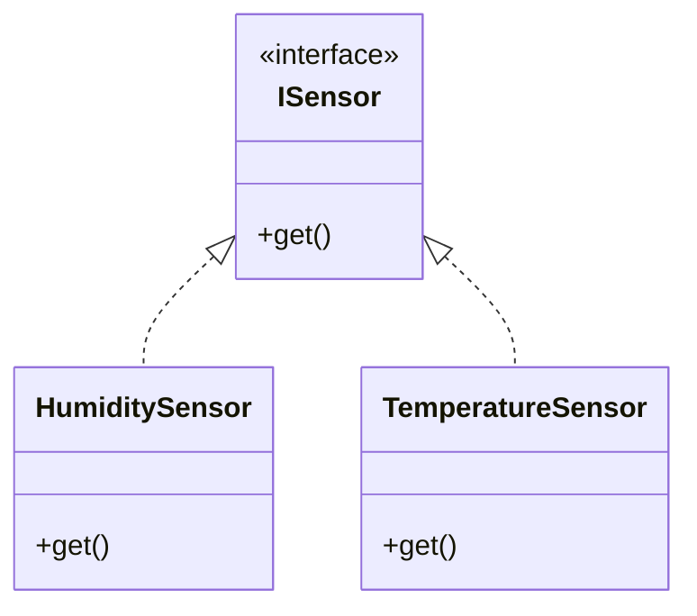

# Coupling and Cohesion

Since design complexity applies to both classes and the methods within them, we will use the term module to refer to any sort of program unit like these

To evaluate design complexity, you need to consider two important metrics: coupling and cohesion.

## Coupling

Coupling for a module captures the complexity of connecting the module to other modules.

If your module is highly reliant on other modules, you would say this module is **tightly coupled** to others. This is like having puzzle pieces. You can only connect a puzzle piece to another specific puzzle piece and nothing else.


On the other hand, if your module finds it easy to connect to other modules, this module is **loosely coupled** to others. This is like Lego. You can connect any two Lego blocks without much trouble, and all Lego blocks are compatible with one another.

You want coupling for your module to be loose or low, not tight.


When evaluating coupling, there are three factors to consider: degree, ease, and flexibility. 

**Degree**: refers to the number of connections between the module and others. With coupling, you want to keep the degree small. 

*For instance, if the module needed to connect to other modules through a few parameters or narrow interfaces, then degree would be small and coupling would be loose*

**Ease**: refers to how obvious the connections between the module and others are. With coupling, you want the connections to be easy to make without needing to understand the implementations of the other modules.

**Flexibility**: is how interchangeable the other modules are for this module. With coupling, you want the other modules easily replaceable for something better in the future.


## Cohesion

Cohesion focuses on complexity within a module. Cohesion represents the clarity of the responsibilities of a module.

If your module performs one task and nothing else, your module has **high cohesion**. 

On the other hand, if your module tries to encapsulate more than one purpose or has an unclear purpose, it has **low cohesion**. 

You want *high cohesion* to ensure that your module is clear and concise.


## Example: Sensor class

Suppose we have a class called sensor that has two purposes, getting humidity and getting temperature sensor readings. Here we have a `get` method that takes a zero flag if you wanted to return the humidity value, and takes the one flag if you want it to return the temperature value.

```java
public void get (int controlFlag) {
  switch (controlFlag){
    case 0:
      return this.humidity;
      break;
    case 1:
      return this.temperature;
      break;
    default:
      throw new UnknownControlFlagException();
  }
}
```

- The sensor class doesn't have a clear single purpose, it suffers from low cohesion
- In the `get` method, it is unclear what `controlFlag` means, we would have to read inside the method itself in order to know what values to give it. This is not respecting **encapsulation** which also shows our method is unclear and lacks **ease**. This lack of ease makes get method harder to use and in turn makes any color tightly coupled to it.

Let's look at a new design of the same system:



- The sensor class is now replaced with `HumiditySensor` class and the `TemperatureSensor` class. Each of these classes has one clearly defined purpose. Since each has a clear purpose, you can say that these classes are **highly cohesive**.
-  The get method is now not hiding any information like before. We don't have to break encapsulation to look inside the method. You could reasonably assume that humidity sensors get method returns humidity and temperature sensors get method returns temperature. This makes another module that uses either be **loosely couple**.


## Balance between low coupling and high cohesion

As modules are simplified to achieve high cohesion, they may need to depend more on other modules thus increasing coupling.

As connections between modules are simplified to achieve low coupling, the modules may need to take on more responsibilities thus lowering cohesion.
