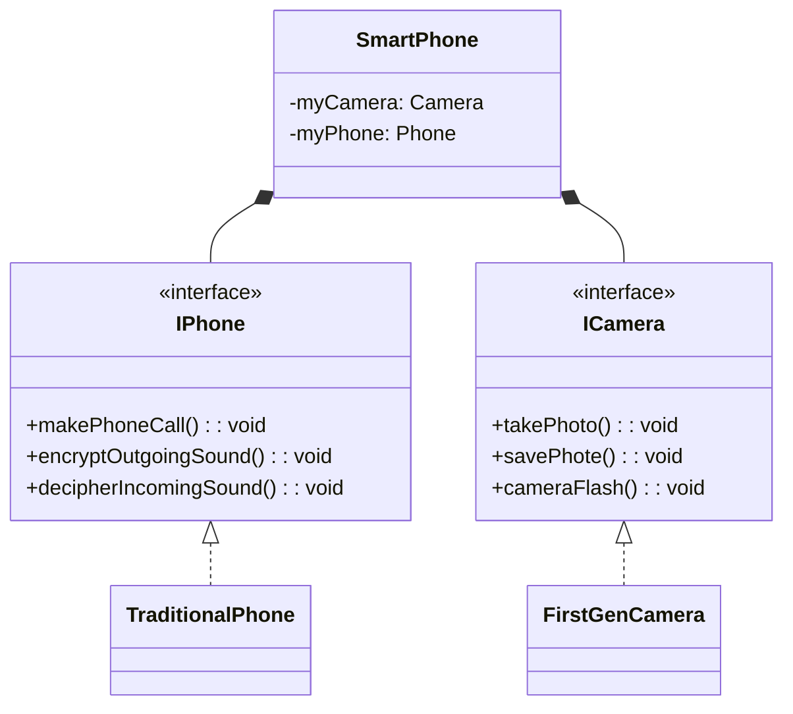

# Separation of Concerns

One of the main goals of software design principles is to create a flexible, reusable, and maintainable system. To achieve this goal, there are several principles that software developers follow, such as **separation of concerns**.

## What is a Concern?

A concern is a general notion that refers to anything that matters when solving a problem.

For example, in a supermarket setting, concerns could be how to butcher meat, bake bread, accept payment, or stock shelves. Each department in a supermarket focuses on addressing specific concerns with unique sub-problems.

## Separation of Concerns in Software Design

As a software system is designed and constructed, designers express how to address different sub-problems by **separating them into separate sections**.

This approach applies throughout object-oriented modeling and programming and involves various design principles, such as obstruction, encapsulation, decomposition, and generalization.

Each concept in the problem space leads to a separate obstruction with its attributes and behaviors encapsulated into their own **section of code called a class**.

**The view of a class by the rest of the system** and **its implementation** are separated so that **while the details of implementation can change, the view through an interface stays the same**.

A whole class can also be **decomposed** into multiple classes, and commonalities among classes can be separated and **generalized** into a super class.

Separation of concerns is an ongoing process throughout the software design process to ensure that each concern is addressed effectively and efficiently.

We should only encapsulate behaviors and attributes within classes that are concerned with those specific behaviors and attributes. 

### Example: Smartphone Class

Let's illustrate the importance of separation of concerns using the example of a smartphone class.

A smartphone has many different behaviors, such as taking photos, making phone calls, sending messages, etc. If we were to design a smartphone class, we might be tempted to simply include all of these behaviors in one class. However, this would result in low cohesion and poor modularity.

```java
public class SmartPhone {
  private byte camera;
  private byte phone;

  public SmartPhone() {  }

  public void takePhoto() { }

  public void savePhoto() {  }

  public void cameraFlash(){ }

  public void makePhoneCall(){ }

  public void encryptOutgoingSound() {  }

  public void decipherIncomingSound() { }
}
```

To apply separation of concerns to our smartphone class, we need to identify the different concerns that our class has. In this case, we could identify two main concerns: acting as a traditional telephone, and using the built-in camera to take pictures.

We can then separate these concerns out into their own more cohesive classes and encapsulate all the details about each into functionally distinct and independent classes.



```java
public interface Camera {
  public void takePhoto();
  public void savePhoto();
  public void cameraFlash();
}

public interface IPhone f
  public void makePhoneCall();
  public void encryptoutgoingSound();
  public void decipherIncomingSound();
}

public class FirstGenCamera implements ICamera {

}

public class TraditionalPhone implements IPhone {
}
```

After applying separation of concerns, our new smartphone design will have separate classes for the camera and the traditional phone functions. We can implement these interfaces correspondingly with the `FirstGenCamera` class and the `TraditionalPhone` class.

Our SmartPhone class will then reference instances of these newly-created classes, allowing it to provide access to all the behaviors of the camera and the phone without having to know how each component behaves.

This creates a more modular design for our phone, where we are able to swap out components without needing to touch the SmartPhone class's code. We simply just change the code to instantiate the smartphone and its parts. The smartphone class is now more cohesive.

```java
public class SmartPhone {
  private Camera myCamera;
  private IPhone myPhone;

  public SmartPhone(ICamera aCamera, IPhone aPhone) {
    this.myCamera = aCamera;
    this.myPhone = aPhone;
  }

  public void useCamera() {
    return this.myCamera.takePhoto();
  }
  
  public void usePhone() {
    return this.myPhone.makePhoneCall();
  }
}
```

While there may be increased coupling in our system, separation of concerns ultimately leads to more flexible, reusable, and maintainable code.