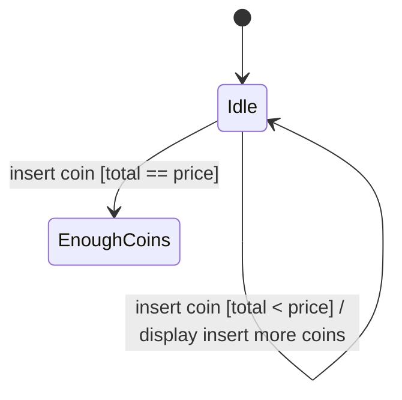

# UML state diagrams

## Introduction

UML state diagrams are a type of UML diagram used to describe the behavior and response of software systems.

They depict the changing states of an object or system in response to different events, which are shown as a series of transitions between states.

The state of an object is determined by its attributes at a particular point in time, and a change in state can result in a change in behavior.

*One way to conceptualize states is through the example of a car with an automatic transmission, which has different states such as park, reverse, neutral, and drive. Just like how a car behaves differently depending on its state, objects in a software system behave in specific ways or have certain attributes set to specific values, depending on their state.*

UML state diagrams are a valuable tool for software developers to understand and design the behavior of their systems.

## Elements of state diagrams

A **filled circle** indicates the **starting state of the object**. Every state diagram begins with a filled circle.

**Rounded rectangles** indicate **other states**. These rectangles have three sections: a state name, state variables, and activities:

- **State names** should be short, meaningful titles for the state of the object. Each state should have at least a state name.
- **State variables** are data relevant to the state of the object.
- **Activities** are actions that are performed when in a certain state. There are three types of activities present for each state: Entry, Exit, and Do activities.
    - **Entry activities** are actions that occur when the state is just entered from another state.
    - **Exit activities** are actions that occur when the state is exited and moves on to another state.
    - **Do activities** are actions that occur while the object is in a certain state.
- **Arrows** indicate **transitions** from one state to another. Transitions are typically triggered by an event. This event is generally described above the arrow. `event[condition]/action`
- A **circle with a filled circle** inside indicates **termination**. Termination represents an object being destroyed or the process being completed. Not all diagrams have a termination—some may run continuously.

## Example: vending machine

## Benefits

State diagrams can be useful to help determine the events that might occur during an object’s lifetime, such as different user inputs, and how that object should behave when these events occur, like checking conditions and performing actions.

State diagrams can also help identify issues in a software system, such as discovering a condition that was unplanned for.

They can also help create tests—knowing the different states of a system can help ensure that tests are complete and correct.